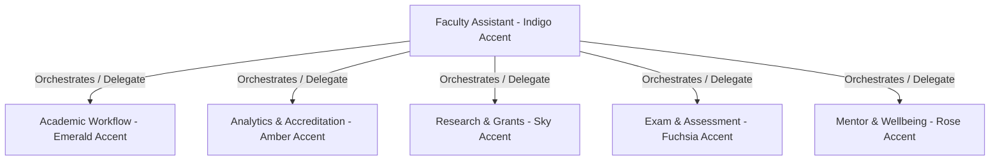

# Faculty OS — Multi-Agent Faculty Platform (6-Agent MVP)

Faculty OS is an integrated multi-agent platform designed for engineering college faculty members to automate daily administrative, academic, research, and wellbeing workflows. 

## 60-Second Architecture Summary

Faculty OS operates as a unified platform with **Faculty Assistant** acting as the orchestrator/front door. Depending on user intent or complex multi-step instructions, it delegates to any of the 5 other specialized agents:



- **1. Faculty Assistant (Indigo):** Personal daily assistant (schedules, lesson plans, RAG over policies/syllabus, email drafting).
- **2. Academic Workflow (Emerald):** Tables/grids for marking student attendance, assignment columns, grading grids, and reminders.
- **3. Analytics & Accreditation (Amber):** KPI cards, performance distribution, attendance trends, at-risk prediction lists, and NBA/NAAC PDF compile reports.
- **4. Research & Grants (Sky):** Timeline lists of faculty publications, grant deadlines, funding matching, and co-author heuristics.
- **5. Exam & Assessment Design (Fuchsia):** Bloom's taxonomy builders, CO coverage targets, question bank CRUD, paper generation, and rubric designers.
- **6. Mentor & Wellbeing (Rose):** Qualitative mentee records, check-in logging, mood tags, timeline logs, and counseling escalation paths.

---

## Technical Stack

- **Frontend:** React + Vite + TypeScript, CSS Themes (no Tailwind light mode, dark only), Lucide Icons, Framer Motion
- **Backend:** FastAPI (Python), SQLAlchemy ORM (SQLite / PostgreSQL), SSE (Server-Sent Events) streaming
- **RAG & Vector DB:** ChromaDB (policy corpora, syllabus topics, past papers)

---

## Environment Variables

Create a `backend/.env` file with:
```bash
DATABASE_URL=sqlite:///./edupilot.db
ANTHROPIC_API_KEY=your_key_here (optional; system falls back to high-fidelity mock generator if key is missing)
```

---

## How to Run

### 1. Run the Backend

Make sure you have Python 3.10+ installed.

1. Navigate to `/backend`
2. Activate the virtual environment:
   ```powershell
   .venv\Scripts\activate
   ```
3. Install dependencies:
   ```bash
   pip install -r requirements.txt
   ```
4. Start the FastAPI server:
   ```bash
   python -m uvicorn main:app --reload --port 8000
   ```
   *The SQLite database is seeded automatically on startup. The API will run on `http://localhost:8000`.*

### 2. Run the Frontend

1. Navigate to `/frontend`
2. Install npm dependencies (if not done):
   ```bash
   npm install
   ```
3. Start Vite dev server:
   ```bash
   npm run dev
   ```
   *The frontend runs on `http://localhost:5173`. Click the dev style guide link to preview component tokens.*
