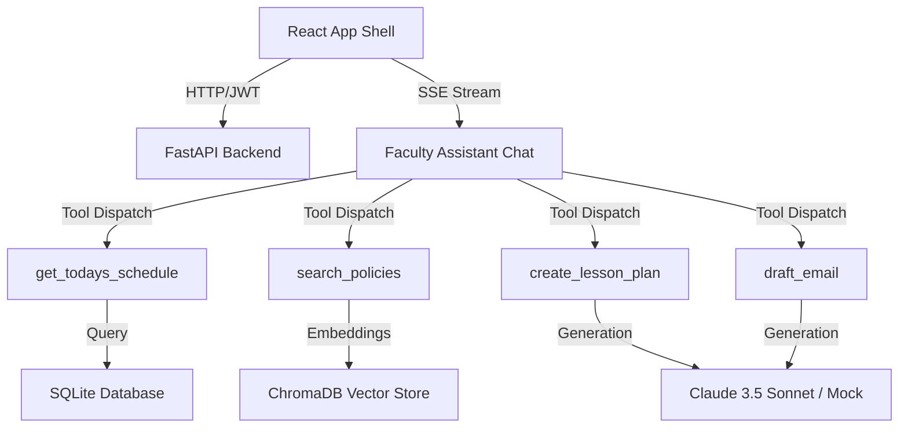

# EduPilot Architecture Spec - Phase 1

EduPilot uses a service-oriented architectural layout structured for high-fidelity multi-agent faculty support.

## Agents & Roles

1. **Faculty Assistant Agent (Indigo):** Main Daily driver orchestrator. Handles schedule lookups, email drafting, syllabus extraction, and general administrative RAG queries.
2. **Academic Workflow Agent (Emerald - Phase 2):** Grid-centric doer agent. Coordinates grading sheets, student roll marks, attendance submissions, and reminders.
3. **Analytics Agent (Amber - Phase 3):** Performance/charts generator. Assesses student at-risk trends and generates accreditation (NBA/NAAC) compliance reports.
